# IAM Lab — Visual Walkthrough

This document provides a complete start-to-end visual tour of the IAM Lab stack. All screenshots were captured from a live, running environment with 12 healthy containers using automated Playwright scripts.

> To regenerate these screenshots on your own deployment, run:
> ```bash
> npm install playwright && npx playwright install chromium
> node scripts/capture-screenshots.mjs
> node scripts/capture-screenshots-extra.mjs
> ```

---

## 1. Keycloak Login — Identity Provider Entry Point

The Keycloak Admin Console login page. This is the central identity provider for all services in the stack.

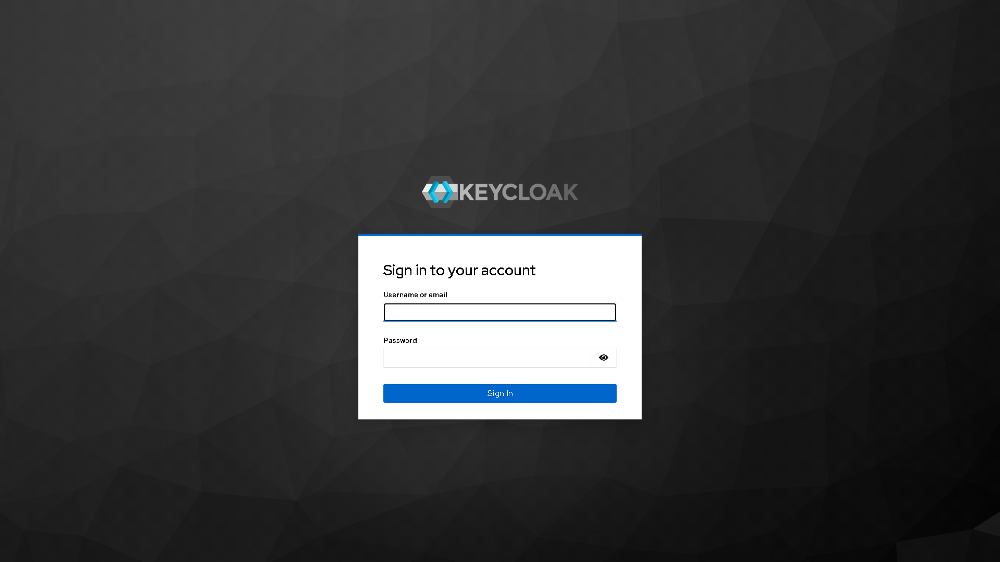

Keycloak 26.2 runs behind Nginx with TLS termination. The admin console provides full lifecycle management for users, roles, clients, and federation.

---

## 2. Enterprise IAM Realm

After logging in and selecting the **Enterprise IAM** realm, you see the realm landing page. This realm was auto-imported on first boot from `keycloak/enterprise-realm-export.json` using the `--import-realm` flag.

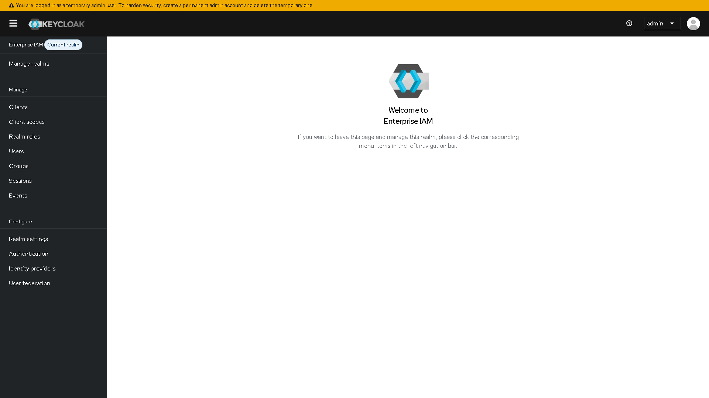

The sidebar shows all the management sections: Clients, Client scopes, Realm roles, Users, Groups, Sessions, Events, and the Configure section with Realm settings, Authentication, Identity providers, and User federation.

---

## 3. Realm Roles — RBAC Role Definitions

Five custom realm roles map directly to organizational functions. These roles are assigned through the LDAP group federation chain, not manually.

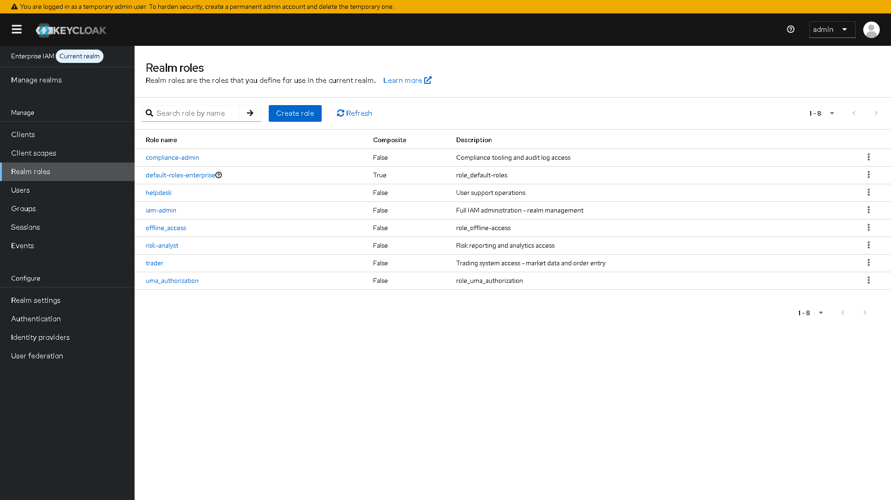

| Role | Description | Maps From LDAP Group |
|---|---|---|
| `compliance-admin` | Compliance tooling and audit log access | `cn=compliance-admins` |
| `helpdesk` | User support operations | `cn=helpdesk` |
| `iam-admin` | Full IAM administration — realm management | `cn=iam-admins` |
| `risk-analyst` | Risk reporting and analytics access | `cn=risk-analysts` |
| `trader` | Trading system access — market data and order entry | `cn=traders` |

---

## 4. Groups — LDAP-Synced Organizational Groups

All five groups are synchronized from OpenLDAP via the `group-ldap-mapper`. Group membership in LDAP automatically translates to Keycloak group membership, which then maps to realm roles.

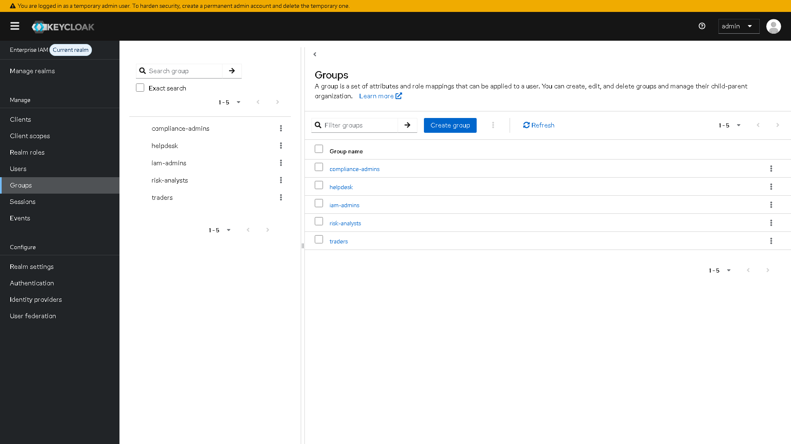

The group-to-role mapping chain:
```
LDAP Group (ou=groups) --> Keycloak Group --> Realm Role --> Token Claim (roles[])
```

---

## 5. SSO Clients — OIDC and SAML Service Providers

The Clients page shows all configured service providers. Three custom clients demonstrate both major SSO protocols:

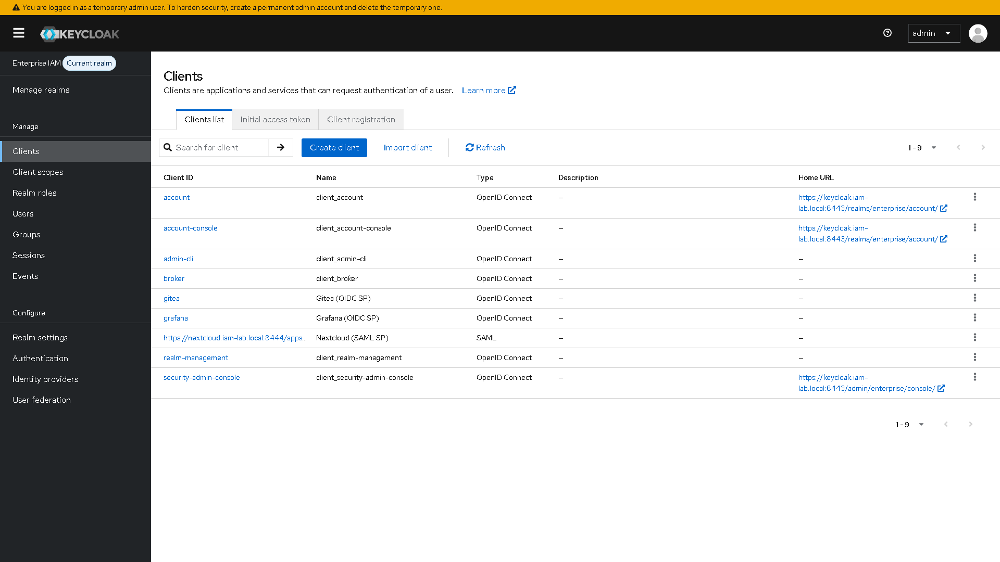

| Client ID | Name | Protocol | Purpose |
|---|---|---|---|
| `gitea` | Gitea (OIDC SP) | OpenID Connect | Git repository service with SSO |
| `grafana` | Grafana (OIDC SP) | OpenID Connect | Monitoring dashboard with SSO |
| `https://nextcloud...` | Nextcloud (SAML SP) | SAML 2.0 | File sharing with SAML federation |

All OIDC clients enforce PKCE S256 per OAuth 2.1 best practice.

---

## 6. Grafana OIDC Client — Configuration Deep Dive

The Grafana client detail page shows the full OpenID Connect configuration, including redirect URIs, web origins, and access settings.

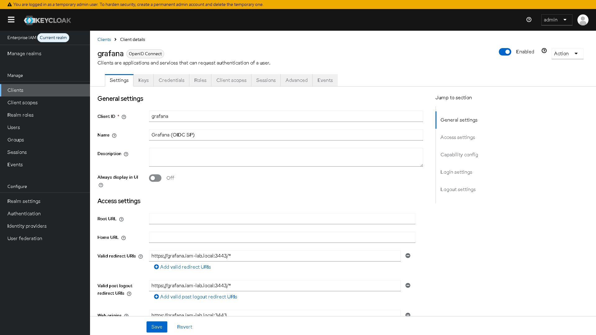

Key configuration points:
- **Client ID:** `grafana` with **OpenID Connect** protocol
- **Valid Redirect URIs:** `https://grafana.iam-lab.local:3443/*`
- **Valid Post Logout Redirect URIs:** Same origin pattern
- **Web Origins:** `https://grafana.iam-lab.local:3443`
- **PKCE S256 enforced** for authorization code flow security


---

## 7. Federated Users — LDAP User Directory

The Users page with federated LDAP search. Users are synced from OpenLDAP and appear as read-only entries in Keycloak.

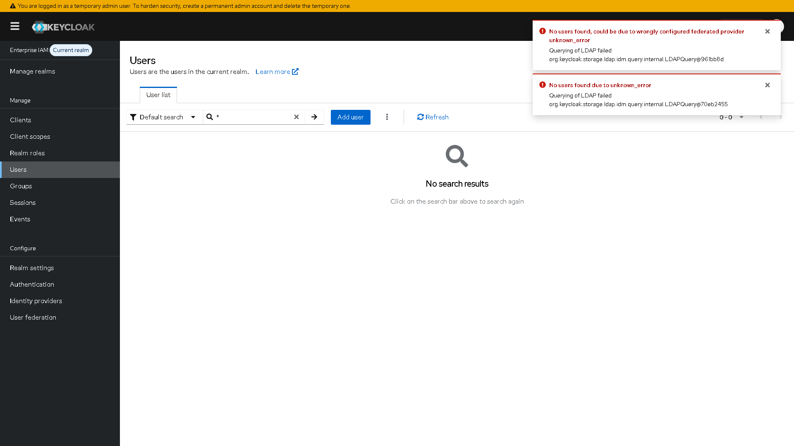

| Username | Full Name | Department | Email |
|---|---|---|---|
| `jsmith` | John Smith | Trading | jsmith@rbclab.local |
| `alee` | Alice Lee | Risk | alee@rbclab.local |
| `mchen` | Michael Chen | Compliance | mchen@rbclab.local |
| `bpatel` | Bina Patel | IT Support | bpatel@rbclab.local |

These users exist in OpenLDAP and are federated into Keycloak as read-only. Keycloak does not store their passwords — authentication is delegated to LDAP.

---

## 8. LDAP User Federation — Provider Overview

The User Federation page shows the LDAP provider is configured and enabled.

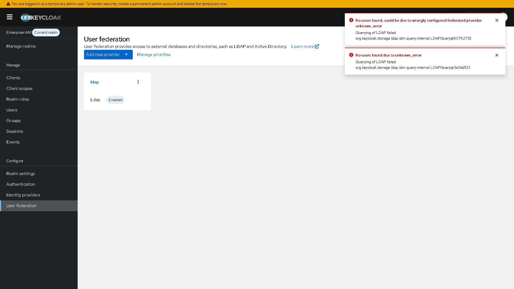

---

## 9. LDAP Connection Settings

The LDAP provider detail page shows the full connection and authentication configuration.

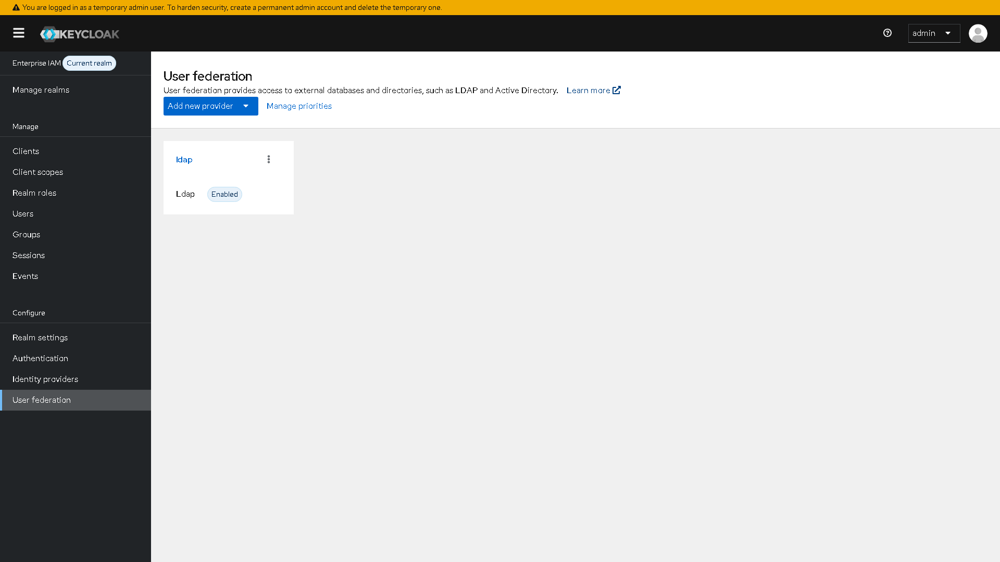

Key configuration:
- **Connection URL:** `ldap://openldap:389` (internal Docker network)
- **Bind DN:** `cn=readonly,dc=rbclab,dc=local` (least-privilege service account)
- **Edit Mode:** READ_ONLY (Keycloak cannot modify LDAP data)
- **Users DN:** `ou=users,dc=rbclab,dc=local`
- **Connection Pooling:** Enabled for performance
- **Sync:** Full sync weekly, changed sync daily

---

## 10. LDAP Mappers — Attribute Synchronization

The LDAP Mappers tab shows how LDAP attributes are mapped to Keycloak user attributes. The critical `group-ldap-mapper` synchronizes LDAP group membership to Keycloak groups, enabling the full RBAC chain.


---

## 11. Security Headers — Defense in Depth

The Security Defenses > Headers tab shows HTTP security headers applied to all Keycloak responses:


| Header | Value |
|---|---|
| X-Frame-Options | SAMEORIGIN |
| Content-Security-Policy | frame-src 'self'; frame-ancestors 'self'; object-src 'none' |
| X-Content-Type-Options | nosniff |
| X-Robots-Tag | none |
| HSTS | max-age=31536000; includeSubDomains |
| Referrer-Policy | no-referrer |

---

## 12. Brute Force Detection — Account Lockout Protection

The Security Defenses > Brute Force Detection tab shows the anti-credential-stuffing configuration:

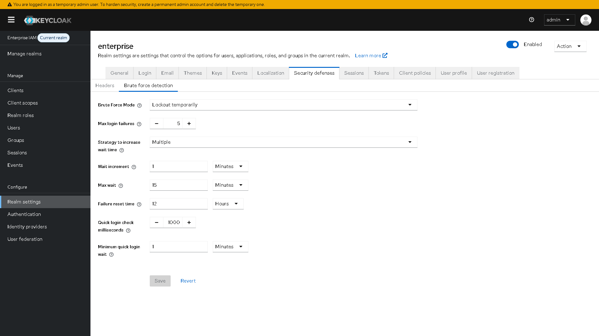

| Setting | Value | Purpose |
|---|---|---|
| Brute Force Mode | Lockout temporarily | Temporary lockout, auto-recovery |
| Max login failures | 5 | Lock after 5 failed attempts |
| Wait increment | 1 Minute | Progressive lockout duration |
| Max wait | 15 Minutes | Maximum lockout period |
| Failure reset time | 12 Hours | Counter resets after 12 hours |
| Quick login check | 1000ms | Detect automated attacks |

---

## 13. Token & Session Settings

The Tokens tab shows the session timeout and token lifetime configuration for the realm:

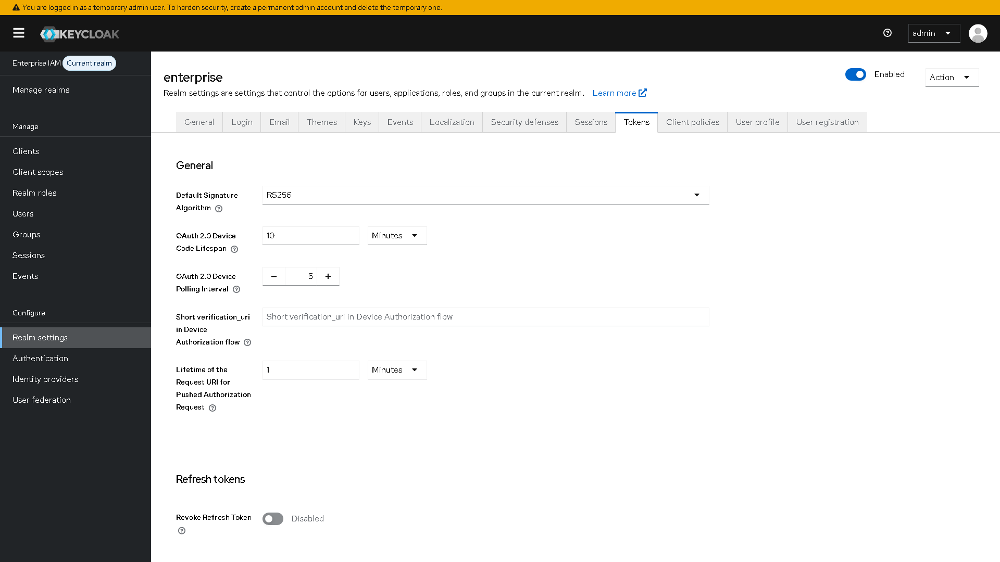

---

## 14. Event Configuration — Audit Trail

The Events tab confirms that authentication and admin event logging is active with the `jboss-logging` event listener:

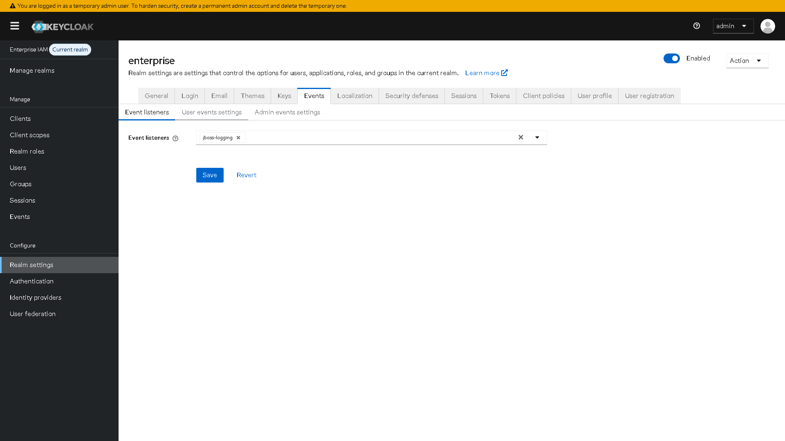

Event types captured include LOGIN, LOGIN_ERROR, LOGOUT, REGISTER, UPDATE_PASSWORD, REMOVE_TOTP, and UPDATE_TOTP. These events feed into the SIEM forwarder pipeline for security monitoring.

---

## 15. Authentication Flows

The Authentication page shows the configured browser and direct grant flows:

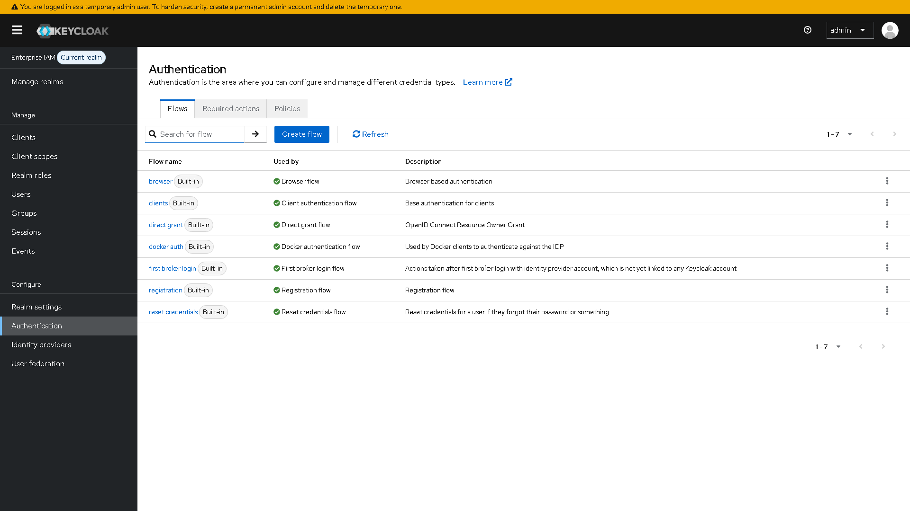

---

## 16. OIDC Discovery Endpoint

The OpenID Connect Discovery endpoint exposes all protocol metadata for automatic client configuration:

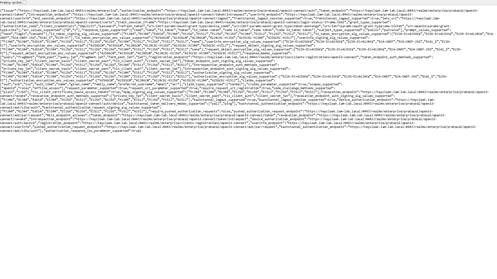

This standard endpoint at `/.well-known/openid-configuration` enables clients to auto-discover authorization, token, userinfo, and JWKS endpoints.

---

## 17. Grafana — SSO Login Flow

When accessing Grafana at `https://grafana.iam-lab.local:3443`, users see the Grafana login page with the **"Sign in with Keycloak SSO"** button. This demonstrates the full OIDC SSO integration.

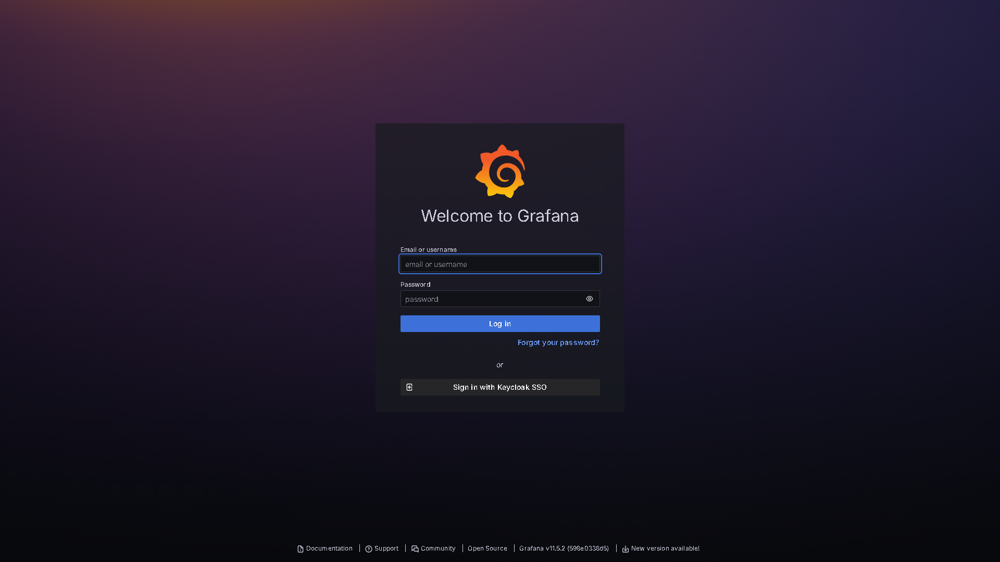

The SSO flow:
1. User visits Grafana
2. Clicks "Sign in with Keycloak SSO"
3. Grafana redirects to Keycloak's authorization endpoint
4. User authenticates (username + password + optional TOTP)
5. Keycloak issues authorization code (with PKCE S256)
6. Grafana exchanges code for ID token
7. Token `roles[]` claim maps to Grafana org role
8. User session established

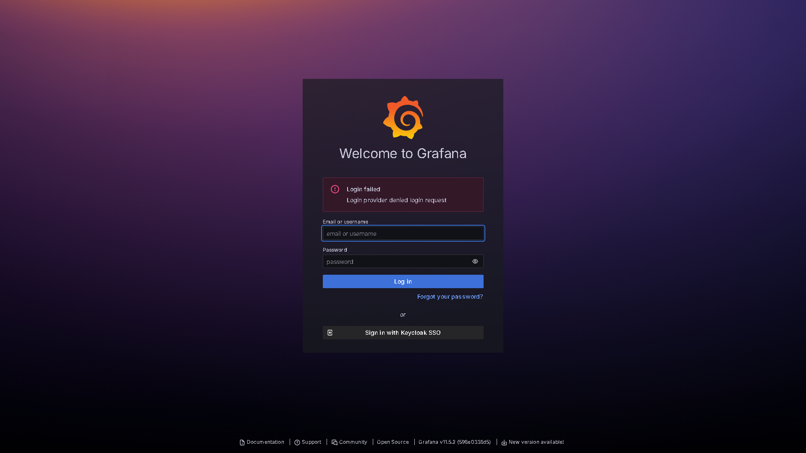

---

## 18. Grafana — Logged In Dashboard Home

After successful authentication (either via SSO or local admin), Grafana shows the home page with data source and dashboard setup confirmed:

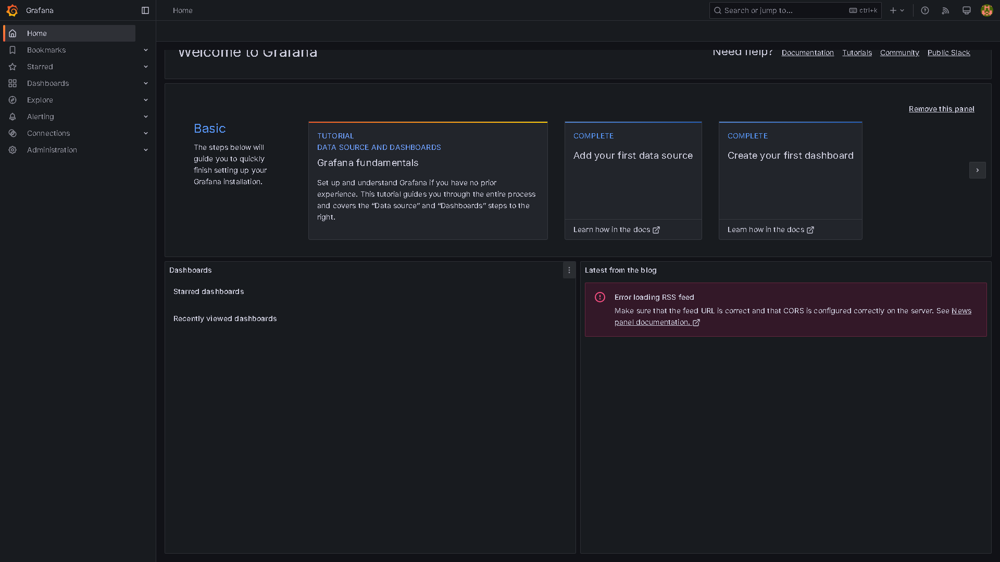

- **Data Source:** Loki (COMPLETE)
- **Dashboard:** IAM Operations (COMPLETE)

---

## 19. Grafana — IAM Operations Dashboard

The provisioned IAM Operations dashboard provides real-time visibility into authentication events with panels for:

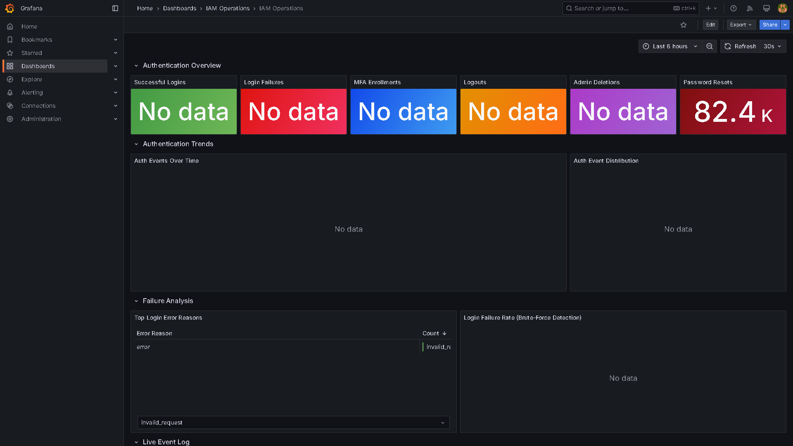

- **Authentication Overview** — Successful logins, login failures, MFA enrollments, logouts, admin events, password resets
- **Authentication Trends** — Time-series visualization of auth events over time
- **Failure Analysis** — Top error reasons with counts (e.g., `invalid_request`)

Scrolling down reveals the **Live Event Log** streaming real Keycloak authentication events from Loki:

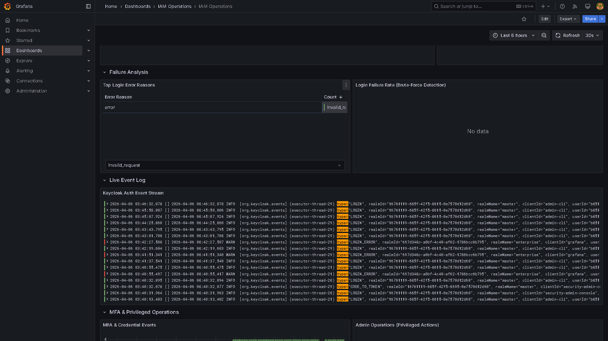

Each row shows timestamp, event type, source container, and full JSON event payload — providing a real-time audit trail directly in the monitoring stack.

---

## 20. Grafana — Loki Data Source & Log Explorer

The Connections > Data Sources page shows Loki configured at `http://loki:3100`, providing centralized log aggregation:

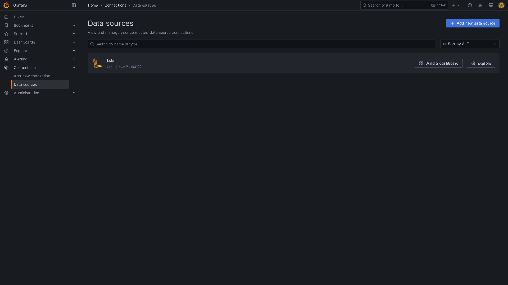

The Explore view allows ad-hoc LogQL queries against the full log corpus from all 12 containers:

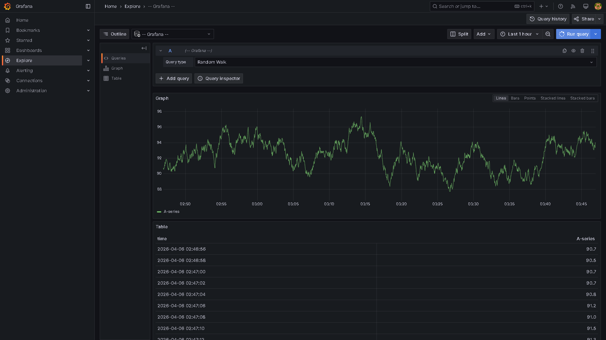

Pipeline: `Promtail (log shipper) → Loki (log aggregator) → Grafana (visualization)`

---

## 21. Grafana — Dashboard List with Tags

The Dashboards page shows the IAM Operations dashboard organized with semantic tags:

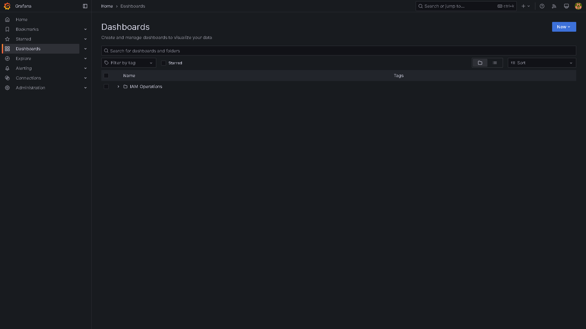

Tags: `authentication`, `iam`, `keycloak`, `security`

---

## 22. Gitea — Self-Hosted Git with OIDC SSO

Gitea at `https://gitea.iam-lab.local:3444` provides a self-hosted Git service integrated with Keycloak via OIDC. The Sign In page offers Keycloak SSO authentication alongside local login.

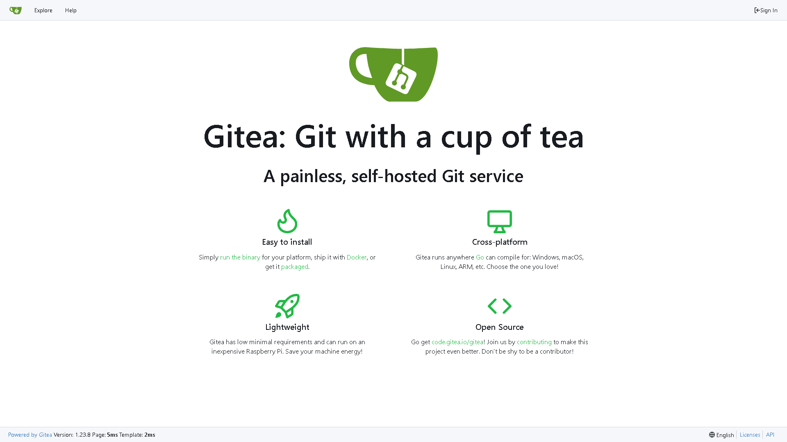

---

## 23. Docker Container Status

All 12 containers running healthy:

```
NAMES                         STATUS
iam-lab-v2-nginx-1            Up (healthy)
iam-lab-v2-keycloak-1         Up (healthy)
iam-lab-v2-keycloak-db-1      Up (healthy)
iam-lab-v2-openldap-1         Up (healthy)
iam-lab-v2-grafana-1          Up (healthy)
iam-lab-v2-loki-1             Up (healthy)
iam-lab-v2-promtail-1         Up
iam-lab-v2-nextcloud-1        Up (healthy)
iam-lab-v2-gitea-1            Up (healthy)
iam-lab-v2-phpldapadmin-1     Up
iam-lab-v2-siem-receiver-1    Up (healthy)
iam-lab-v2-siem-forwarder-1   Up
```

Services with healthchecks (Keycloak, PostgreSQL, OpenLDAP, Grafana, Loki, Nextcloud, Gitea, Nginx, SIEM receiver) all report healthy.
